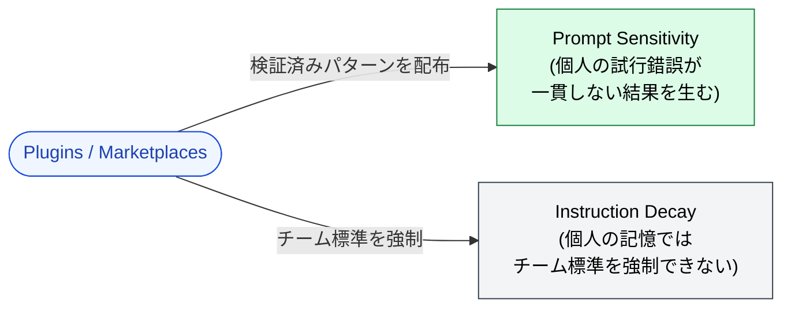

🌐 [English](../../appendix/plugins-and-marketplaces.md)

# Plugins & Marketplaces

> [!NOTE]
> **検証済みの設定**を配布する仕組み — CLAUDE.md、Skills、Hooks、Agents、MCP サーバ、スラッシュコマンドを、インストール可能なパッケージとしてまとめる。それ自体は構造的対策ではないが、「Part 3〜10 を組織の全員に実際に適用させるにはどうすればよいか?」に対する実践的な答えである。

## なぜこのページが Appendix にあり、メイン Part にはないのか

Plugins と Marketplaces は*配布インフラ*であり、新しい設計対象ではない。これらが助けるすべての問題は、すでに Part 1〜11 でカバーされている。これらが追加するのは、それらの対策を**チーム全体で共有可能・バージョン管理可能・強制可能な形で配布する手段**であり、1 人のエンジニアのローカル設定の中に閉じ込められた状態ではなくする手段である。

これは「Claude Code 設定のための npm」のような位置づけで、「LLM の新機能」ではない。構造的問題はそのまま残る。変わるのは配信メカニズムである。

## Plugin が同梱できるもの

Plugin は次のいずれも含めることができるディレクトリである:

| コンポーネント | 提供するもの | カバーされる場所 |
|:--|:--|:--|
| CLAUDE.md フラグメント | プロジェクト全体の指示 | [Part 3](../03-always-loaded-context/index.md) |
| `.claude/rules/` ファイル | 条件付きで読み込まれるルール | [Part 4](../04-conditional-context/index.md) |
| Skills | タスク固有の手続き | [Part 5](../05-on-demand-context/skills.md) |
| Agent 定義 | サブエージェントの仕様 | [Part 5](../05-on-demand-context/agents.md) |
| MCP サーバ設定 | 外部サービスへの接続 | [Part 6](../06-tool-context/index.md) |
| Hooks | ライフサイクルスクリプト | [Part 7](../07-runtime-layer/hooks.md) |
| スラッシュコマンド | カスタムコマンド | [Part 7](../07-runtime-layer/index.md) |

Plugin は概念的には**Part 3〜7 のうち、1 つのチームが標準化する価値があると判断したものすべてのバンドル**である。Plugin をインストールする → それらの設定がすべて一度に適用される。

## → Why: どの構造的問題に対応しているか

Plugins は構造的問題を直接解くわけではない。*メタ*問題を解く: 構造的問題への対策が、それを使うべき全員に*実際に使われる*ようにすること。

### Prompt Sensitivity（間接対策）

[Part 1: Prompt Sensitivity](../01-llm-structural-problems/prompt-sensitivity.md) では、意味的に同等のプロンプトが異なる出力を生むことを示した。1 人での対策は丁寧なプロンプトエンジニアリングである。*チーム*での対策は: 既に動作することが検証されたプロンプトを配布することである。

Plugin は、1 人のエンジニアの苦労して得た発見 (「この正確な言い回しが確実に正しい挙動を引き出す」) を、全エンジニアのデフォルトにする。チームの次の人はゼロから始めない。チームが蓄積してきたキャリブレーションから始める。

### Instruction Decay（間接対策）

[Part 1: Instruction Decay](../01-llm-structural-problems/instruction-decay.md) では、個別の指示が長い会話で忘れられることを扱った。それと並ぶ、より上位の劣化もある: **組織的劣化**である。シニアエンジニアが去る; 彼女の CLAUDE.md も一緒に去る。チームの慣習が一度書き留められた後、新しい採用者がそれを見ないままドリフトしていく。

Plugins は組織知識をインストール可能にする。慣習は記憶やオンボーディングの熱心さに依存しない; Plugin に含まれて出荷され、Plugin がインストールされた瞬間に適用される。

## Marketplace が追加するもの

単一の Plugin は tarball や git リポジトリとして渡せる。Marketplace は次を追加する:

- **発見可能性**。エンジニアは関連する Plugin を、聞いて回らずに見つけられる。
- **バージョン管理**。Plugin はピン留め、アップグレード、ロールバックができる。
- **信頼の手がかり**。キュレーション、評価、組織レベルの来歴のいずれかを通じて、Marketplace はどの Plugin がインストール安全かを判断する基準を提供する。
- **強制**。組織レベルの Marketplace は特定の Plugin を必須化できる — すべての開発者の Claude Code がそれをインストールする。

Marketplace は「Plugin を作った」を「これがチームの仕事の進め方である」に変えるものである。

## いつ Plugin に手を伸ばすか

> [!TIP]
> 設定が個人の CLAUDE.md ではなく Plugin に属する 3 つの兆候:
>
> 1. **2 回以上説明している**。3 人目のチームメイトのオンボーディングが同じ指示を含むなら、その指示は Plugin に属する。
> 2. **設定がコードから自明でない**。経験豊富なエンジニアが吸収したが新人には推論できない慣習 (好まれるライブラリ、非推奨パターン、社内ツールの癖) こそ Plugin が捕捉するものである。
> 3. **複数のリポジトリで同じセットアップが必要**。CLAUDE.md をリポジトリ間でコピペしている瞬間こそ、代わりに Plugin に抽出する時である。

## Plugin を使うべきではないとき

> [!WARNING]
> Plugin は無料ではない。設定をパッケージ化する前に:
>
> - **1 リポジトリ・1 ユーザーのための Plugin はオーバーヘッドである**。ローカルの CLAUDE.md / Skills の方がシンプルで、反復も速い。
> - **Plugin は中身を*そのまま*配布する**。間違いも含めて。Marketplace に push されたバグ付き Plugin は、バグ付きローカル設定より取り戻しが難しい。
> - **ピン留めは重要**。チームの Plugin がバージョン固定されていないと、上流の変更がすべての開発者の挙動を密かに変えることがある。Plugin は依存関係として扱い、他の依存関係に適用するのと同じバージョニング規律を適用する。

## 具体例: 自作 MCP サーバ群を Plugin としてパッケージ化する

複数の MCP サーバを構築したエンジニア — 例えば、ドメイン固有の検索 MCP、法令検索 MCP、OCR MCP — にとって、自然な配布単位は次を含む Plugin である:

- MCP サーバのエントリポイントをリスト化する (Claude Code がそれらを起動する方法を知るため)。
- 各 MCP がいつ適切かを説明する Skill を同梱する (Claude Code がそれらを*いつ使うか*を知るため — [Part 5 Skills](../05-on-demand-context/skills.md) 参照)。
- 任意で、MCP の結果を検証ステップに繋ぐ Hooks を出荷する。

Plugin 名は「このエンジニアの MCP 仕事が何をするか」の単位になる — 全体としてインストール可能、全体として引用可能、全体としてバージョン管理可能。これが再利用可能な MCP コレクションの背後にある実践的なパターンである。

## リスクと留意点

> [!CAUTION]
> Plugin と Marketplace の仕組みは急速に進化している。具体的なコマンド、マニフェスト形式、CLI サーフェスは変わる。このページは**なぜこの抽象が存在するか**を扱うのであり、現在の API ではない。
>
> API が変わっても、底にある原則は変わらない: 組織は検証済み設定を配布する手段が必要であり、個人は他人の検証済み仕事を再構築せずインストールする手段が必要である。現在の Claude Code リリースがそれを何と呼んでいようと、それが探すべきものである。

## 他のパートとの関係

- [Part 1: Prompt Sensitivity](../01-llm-structural-problems/prompt-sensitivity.md) — Plugin で配布されるプロンプトが間接的に緩和する構造的問題。
- [Part 1: Instruction Decay](../01-llm-structural-problems/instruction-decay.md) — Plugin の中で生き延びる指示は、セッション、採用、離職を跨いで生き延びる。
- [Part 3: CLAUDE.md](../03-always-loaded-context/claude-md.md) — ほとんどの Plugin は CLAUDE.md フラグメントを出荷する; そのページを先に理解する。
- [Part 5: Skills](../05-on-demand-context/skills.md) — Skills は最も Plugin と相性の良い Claude Code 資産である; 多くの Plugin は本質的に「Skill とそれが依存する MCP のセット」である。

---

> **前へ**: [FAQ](faq.md)

> **次へ**: [用語集](glossary.md)

> 新しい質問や議論は [Discussions](https://github.com/shuji-bonji/understanding-llm-through-claude-code/discussions) へ
